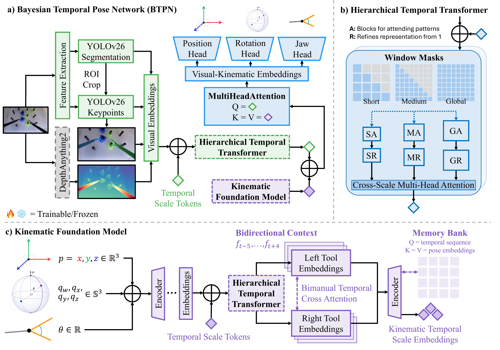
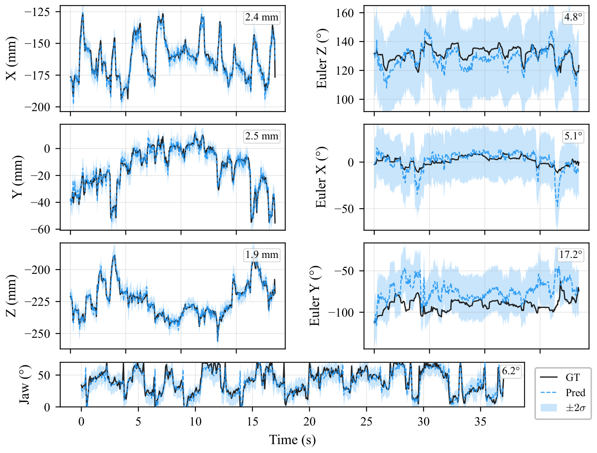
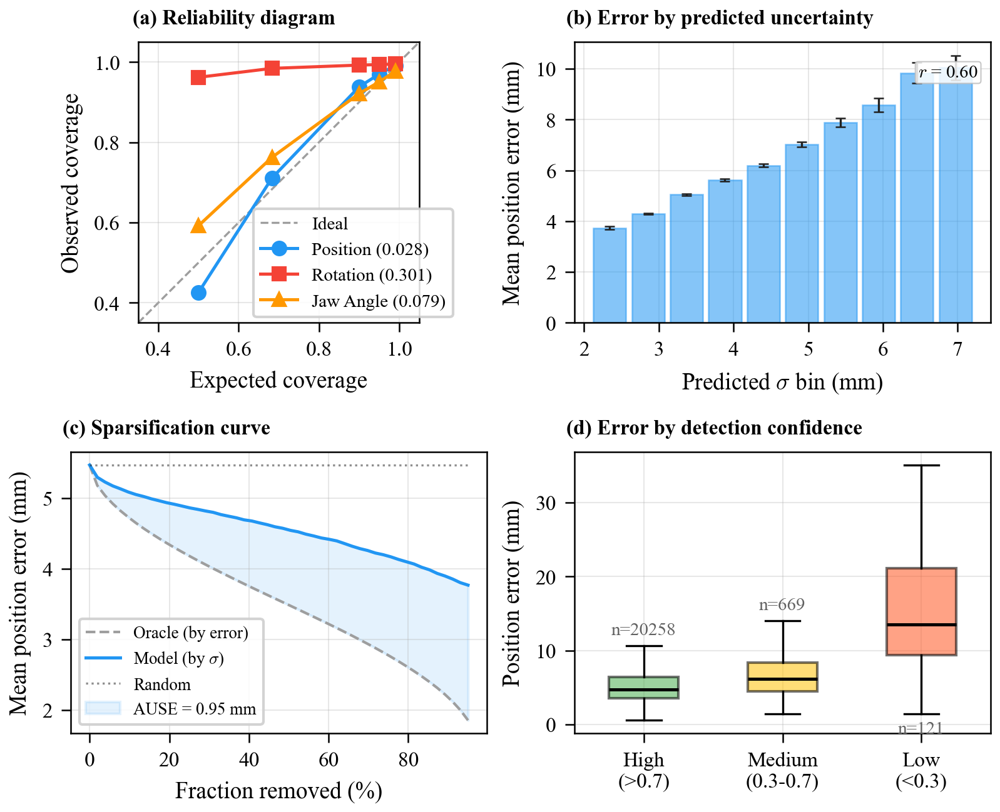
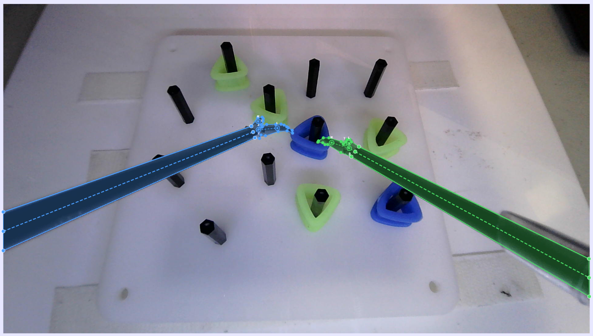
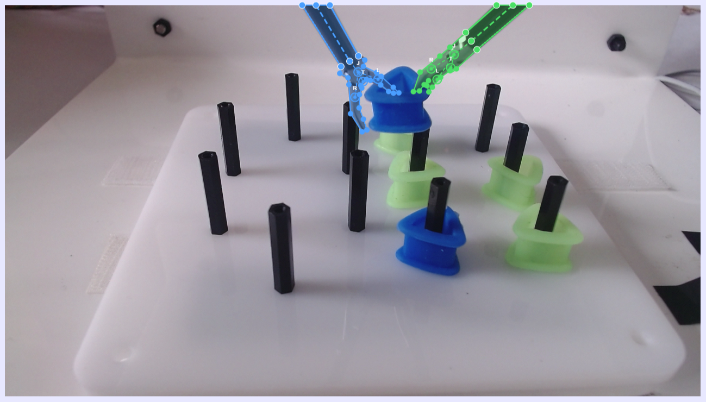
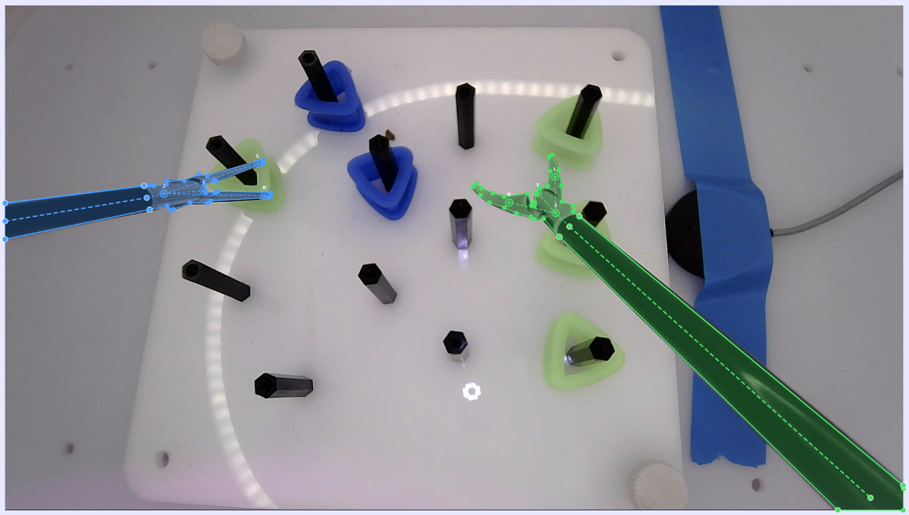

<div align="center">

# Bayesian Temporal Pose Networks

### Uncertainty-Calibrated Laparoscopic Tool Pose Tracking

[](#citation)
[](LICENSE)
[](https://python.org)
[](https://pytorch.org)

<!-- **[Paper](link) | [Poster](link) | [Video](link)** -->

*A probabilistic framework for 7-DoF vision-only laparoscopic tool pose tracking with calibrated Bayesian uncertainty, validated on 114 peg transfer trials across three electromagnetic tracking datasets.*

</div>

---

<p align="center">
  
</p>

**Architecture overview.** BTPN is built from five components, mapped onto the three panels above.

- **Visual feature extraction (panel a).** YOLOv26m-seg localises and segments both tools, producing per-tool ROI crops that YOLOv26m-pose turns into 8 keypoints each (proximal/distal shaft, joint, tip and both jaws); a gated fusion of these cues yields a 256D visual token. DepthAnything V2 (Small), a frozen DINOv2 encoder, adds 128D monocular depth cues.
- **Kinematic Foundation Model (panel c).** A self-supervised, ~1.2M-parameter encoder embeds the 30D per-frame kinematic state (position **p**, quaternion **q** and jaw for both tools) to 256D. A bidirectional context window (*f*<sub>*t*&minus;5..*t*+4</sub>) drives masked-pose reconstruction during pre-training and future-pose prediction during fine-tuning, learned over ~330K electromagnetic-tracking frames.
- **Hierarchical Temporal Transformer (panel b).** Six layers apply windowed attention at clinically motivated scales — local (8 frames &approx;0.6 s), medium (20 frames &approx;1.5 s) and global — each scale pairing an attention block with a refinement block, then fused by cross-scale multi-head attention.
- **Memory-Enhanced Encoder (panel c).** Each tool is projected separately and the two are coupled by quaternion-aware bimanual cross-attention with learnable gates; a memory bank — queried by the temporal sequence, with the pose embeddings as keys/values — stores the per-scale kinematic embeddings.
- **Cross-modal fusion + pose heads (panel a).** An image-based HTT/MEE produces visual embeddings **V**; four-head attention (**V** as queries, kinematic **K** as keys/values) yields a fused 256D visual-kinematic token. Gated residual corrections to the kinematic prior — per-channel confidence gates (position &le; 0.5, rotation &le; 0.3, jaw &le; 0.5) prevent noisy visual estimates from corrupting modalities where kinematics are already accurate — feed separate heads predicting position (Cholesky-factored Gaussian), orientation (von Mises&ndash;Fisher concentration on **S**<sup>3</sup>) and jaw (scalar Gaussian) with calibrated Bayesian uncertainty.

## Abstract

Accurate pose tracking of laparoscopic instruments from monocular endoscopic video in surgical training tasks is essential for computer-assisted surgery and objective skill assessment. However, current methods require geometric priors unavailable in non-robotic settings and lack temporal reasoning across multimodal cues and uncertainty quantification. We introduce **Bayesian Temporal Pose Network (BTPN)**, a framework that fuses visual and kinematic features through hierarchical multi-scale temporal attention with calibrated Bayesian uncertainty. A fine-tuned segmentation backbone achieves **91.1% mAP<sub>50-95</sub>** and keypoint detection reaches **94.6% mAP<sub>50-95</sub>**. End-to-end visual pose tracking attains **6.8 mm** position error and **11.9°** rotation (geodesic) with **0.013** expected calibration error. The framework is validated on three electromagnetic tracking datasets with 114 peg transfer trials, demonstrating that uncertainty-aware, vision-only tracking can support interpretable surgical skill assessment.

## Highlights

| | Metric | Value |
|---|---|---|
| :dart: | **Position RMSE** | 6.8 mm on held-out surgical trials |
| :triangular_ruler: | **Rotation (geodesic)** | 11.9° with calibrated uncertainty |
| :microscope: | **Segmentation** | 91.1% mAP<sub>50-95</sub> |
| :straight_ruler: | **Keypoints** | 94.6% mAP<sub>50-95</sub> |
| :bar_chart: | **Calibration (ECE)** | 0.013 — well-calibrated uncertainty |
| :hospital: | **Validation** | 114 peg transfer trials across 3 datasets |

---

## Key Results

### (a) Visual Pipeline Components

| Component | Precision | Recall | mAP<sub>50</sub> | mAP<sub>50-95</sub> |
|:----------|:---------:|:------:|:-----------------:|:--------------------:|
| Detection | 98.1 | 98.3 | 99.1 | 97.5 |
| Segmentation | 98.1 | 98.3 | 99.1 | 91.1 |
| Keypoints | 97.3 | 97.3 | 98.3 | 94.6 |

### (b) Pose Prediction — Dataset A Held-Out Trials

| Method | Pos *x* | Pos *y* | Pos *z* | Pos ‖v‖ | Roll | Pitch | Yaw | Geo | Jaw (°) | ECE |
|:-------|:-------:|:-------:|:-------:|:--------:|:----:|:-----:|:---:|:---:|:-------:|:---:|
| ART-Net | 19.7 | 20.7 | 14.9 | 32.2 | 65.6 | 30.8 | 67.5 | 55.3 | 5.73 | 0.154 |
| Visual regr. | 18.3 | 17.0 | 13.1 | 28.2 | 53.0 | 27.2 | 54.8 | 44.1 | 6.30 | 0.137 |
| Visual + LSTM | 17.2 | 13.3 | 12.4 | 25.0 | 76.9 | 36.8 | 68.1 | 67.9 | 5.73 | 0.099 |
| Visual + TCN | 15.1 | 11.9 | 11.0 | 22.2 | 72.1 | 37.3 | 68.7 | 66.6 | 5.73 | 0.240 |
| Visual + VTT | 16.4 | 13.7 | 12.5 | 24.8 | 74.0 | 45.7 | 79.8 | 69.1 | 5.73 | 0.115 |
| Kinematic regr. | 5.2 | 5.8 | 3.9 | 8.7 | 32.8 | 17.3 | 30.9 | 27.7 | 1.72 | 0.092 |
| **Full BTPN** | **4.1** | **4.4** | **3.5** | **6.8** | **14.7** | **7.3** | **15.8** | **11.9** | **1.72** | **0.013** |

> Position errors in mm, rotation errors in degrees. Geo = geodesic distance on SO(3).

### (c) Cross-Dataset Generalisation

| Dataset | Role | Pos *x* | Pos *y* | Pos *z* | Pos ‖v‖ | &Delta;Rot (°/step) | Jaw (°) |
|:--------|:----:|:-------:|:-------:|:-------:|:--------:|:-------------------:|:-------:|
| A (21 trials) | Held-out | 4.1 | 4.4 | 3.5 | 6.8 | 14.0 | 1.7 |
| B (30 trials) | In-dist. | 6.2 | 5.5 | 4.9 | 9.6 | 20.4 | 1.7 |
| C (24 trials) | OOD | 5.4 | 7.3 | 7.2 | 11.6 | 19.6 | N/A |

### Qualitative Results

<p align="center">
  
</p>

**7-DoF predictions for a held-out trial sequence.** Ground truth (black solid) vs BTPN predictions (blue dashed) with &plusmn;2&sigma; uncertainty bands (shaded). Left column shows position (X, Y, Z in mm); right column shows Euler rotation components and jaw angle in degrees. Per-axis RMSE annotations range from 1.9–2.5 mm for position and 4.8–17.2° for rotation. The model accurately tracks rapid tool motions with well-calibrated uncertainty that widens during challenging periods.

<p align="center">
  
</p>

**Uncertainty quality assessment.** **(a)** Reliability diagram: position (ECE = 0.017) and jaw angle (ECE = 0.061) are well-calibrated, while rotation is over-conservative (ECE = 0.179), reflecting the inherent difficulty of recovering orientation from monocular images. **(b)** Mean position error binned by predicted &sigma; (*r* = 0.62): a clear monotonic trend confirms higher predicted uncertainty corresponds to higher actual error. **(c)** Sparsification curve: discarding the most uncertain 50% of predictions reduces mean error from 5.9 mm to ~3.5 mm (AUSE = 1.08 mm), close to the oracle ordering by true error. **(d)** Position error stratified by detection confidence — error is 5.9 mm at high confidence (*n* = 8,120) and degrades to 23.4 mm only for rare low-confidence frames (*n* = 48).

### Datasets

<table>
<tr>
<td align="center" width="33%">
<br/>
<b>Dataset A</b><br/>60 trials &middot; 7-DoF &middot; 13 fps
</td>
<td align="center" width="33%">
<br/>
<b>Dataset B</b><br/>30 trials &middot; 7-DoF &middot; 13 fps
</td>
<td align="center" width="33%">
<br/>
<b>Dataset C</b><br/>24 trials &middot; 6-DoF &middot; 26 fps
</td>
</tr>
</table>

> **Full dataset download:** _to be added._ The full datasets (raw video,
> kinematics and precomputed visual features) are not yet publicly hosted; the
> link will be added here. Training (`scripts/train.py`) and the full
> evaluation path **(B)** require these. **You do not need them to reproduce the
> headline Dataset-A table or the figures** — the committed
> `results/evaluation_data.npz` and the bundled `data/sample_a` + `data/sample_c`
> trials are sufficient for the offline reproduction and the inference demo.

---

## Installation

```bash
git clone https://github.com/omariosc/BTPN.git
cd BTPN
git lfs pull          # fetch checkpoints + evaluation data (tracked with Git LFS)
pip install -e .
```

> **Requirements:** Python 3.10+, PyTorch 2.0+. A CUDA GPU is recommended for
> training and the full evaluation path **(B)**, but the **offline
> reproduction, the figures, and the inference demo all run CPU-only** — no GPU
> required. Verified end-to-end on CPU with `torch` 2.x, `ultralytics` 8.x.

## Quick Start

### Inference demo on the bundled sample trial (CPU)

The kinematic-prior model runs on the included `data/sample_a` trial with no
GPU and no extra data:

```bash
python scripts/inference.py \
    --checkpoint checkpoints/kinematic_foundation.pt \
    --trial data/sample_a \
    --norm-stats checkpoints/kinematic_foundation_norm.npz \
    --mc-samples 5 \
    --output predictions.npz
```

This prints a per-tool position / rotation / jaw summary and saves
`predictions.npz`. The same command also runs on the 6-DoF sample
(`--trial data/sample_c`); note that sample is a short 6-DoF clip evaluated
with the 7-DoF foundation prior and Dataset-A normalization, so it exercises
the pipeline end-to-end but its error numbers are not accuracy-meaningful.

The two YOLO checkpoints (`yolo_segmentation.pt`, `yolo_keypoints.pt`) also
load and predict on the sample frames (`data/sample_a/frames`,
`data/sample_c/frames`) on CPU via `ultralytics`.

### Inference with the full BTPN model

```python
from btpn import BTPN, BTPNConfig

config = BTPNConfig.from_yaml("configs/btpn.yaml")
model = BTPN.load_pretrained("checkpoints/btpn_supervised.pt", config)
model.eval()

# Run inference on a trial
predictions = model.predict(trial_data)
print(f"Position: {predictions['position'].shape}")      # (T, 2, 3)
print(f"Quaternion: {predictions['quaternion'].shape}")    # (T, 2, 4)
print(f"Sigma (pos): {predictions['sigma_pos'].shape}")   # (T, 2, 3)
```

### Training from Scratch

```bash
# Stage 1: Train Kinematic Foundation Model
python scripts/train.py --stage foundation --config configs/kinematic_foundation.yaml

# Stage 2: Visual SSL Pre-training
python scripts/train.py --stage ssl --config configs/btpn.yaml

# Stage 3: Supervised Fine-tuning
python scripts/train.py --stage supervised --config configs/btpn.yaml

# (Optional) Train detection models
python scripts/train.py --stage detection --task segmentation --config configs/detection.yaml
python scripts/train.py --stage detection --task keypoints --config configs/detection.yaml
```

### Evaluation

There are **two** evaluation entry points. Use **(A)** to reproduce the
headline Dataset-A numbers on any machine; use **(B)** for the full,
from-scratch evaluation once the datasets are available.

**(A) Offline reproduction — CPU-only, no GPU, no full dataset.**
Recomputes the **Full BTPN / Dataset A** pose and calibration metrics directly
from the committed predictions in `results/evaluation_data.npz`. This is the
command that reproduces the headline row of [Key Results (b)](#b-pose-prediction--dataset-a-held-out-trials):

```bash
python scripts/evaluate.py --from-npz results/evaluation_data.npz
```

It prints a side-by-side table of *reproduced vs paper* values and writes
`results/table2b_reproduced.tex` and `results/evaluation_reproduced.json`.
See [Reproducing the results table](#reproducing-the-results-table) for the
exact numbers this emits.

**(B) Full evaluation from the trained model — requires the full datasets + a GPU.**
Runs the model (MC-Dropout) over every held-out trial, recomputing all
metrics and the cross-dataset numbers. This needs the datasets and their
precomputed visual features at the path set in `configs/paths.yaml`
(**dataset download link: _to be added_ — see [Datasets](#datasets)**):

```bash
# Evaluate on Dataset A (held-out trials)
python scripts/evaluate.py --checkpoint checkpoints/btpn_supervised.pt --dataset A

# Evaluate on all datasets and (re)generate LaTeX tables
python scripts/evaluate.py --checkpoint checkpoints/btpn_supervised.pt --dataset all --output-tables
```

### Reproducing the paper figures

```bash
# Figures 3 (trajectories) and 4 (uncertainty) from the committed predictions
python scripts/generate_figures.py --data results/evaluation_data.npz --output-dir figures

# All figures incl. supplementary per-trial breakdown
python scripts/generate_figures.py --data results/evaluation_data.npz --all --output-dir figures
```

> Figure generation denormalizes the saved arrays to physical units (mm,
> unit quaternions) using `checkpoints/btpn_norm.npz` by default.

---

### Reproducing the results table

Running command **(A)** above on a fresh CPU-only clone reproduces the
**Full BTPN / Dataset A** row from `results/evaluation_data.npz`. The position
and rotation numbers match the published Table 2 to one decimal place:

| Metric | Reproduced (CPU, from npz) | Paper Table 2 |
|:-------|:--------------------------:|:-------------:|
| Pos *x* / *y* / *z* (mm) | 4.2 / 4.4 / 3.4 | 4.1 / 4.4 / 3.5 |
| Pos ‖v‖ (mm) | 7.0 (mean 5.5) | 6.8 |
| Roll / Pitch / Yaw (°) | 14.2 / 6.9 / 15.3 | 14.7 / 7.3 / 15.8 |
| Geodesic (°) | 11.7 | 11.9 |
| Jaw (°) | see note | 1.72 |
| ECE | 0.029 | 0.013 |

> **Notes on the two differing cells.** The ‖v‖ "All" column is the RMSE of the
> per-frame Euclidean error (= quadrature sum of the per-axis RMSEs ≈ 7.0 mm);
> the mean Euclidean error is 5.5 mm. The **jaw** and **ECE** values produced
> from the committed `evaluation_data.npz` (jaw RMSE ≈ 0.003 calibrated-angle
> units; position ECE 0.029) match the committed `results/table2b.tex`
> (`0.003` / `0.028`) but differ from the paper's headline `1.72°` / `0.013`.
> The published Table 2 is authoritative and is reproduced verbatim above in
> [Key Results](#b-pose-prediction--dataset-a-held-out-trials); the offline
> command reports exactly what the committed predictions contain. The other
> rows of Table 2 (ART-Net, Visual regr./LSTM/TCN/VTT, standalone Kinematic
> regr., and the cross-dataset B/C numbers) come from separate models/datasets
> not contained in `evaluation_data.npz` and require path **(B)** with the full
> datasets to regenerate.

---

## Pre-trained Checkpoints

| Model | File | Size | Description |
|:------|:-----|:----:|:------------|
| Kinematic Foundation | `kinematic_foundation.pt` | 143 MB | Multi-scale temporal pose predictor (frozen prior) |
| Kinematic Norm Stats | `kinematic_foundation_norm.npz` | <1 KB | Z-score normalization statistics |
| BTPN SSL | `btpn_ssl.pt` | 126 MB | Stage 1: Visual SSL pre-trained encoder |
| **BTPN Supervised** | **`btpn_supervised.pt`** | **131 MB** | **Stage 2: Final model (paper results)** |
| BTPN Norm Stats | `btpn_norm.npz` | <1 KB | Stage 2 normalization statistics |
| YOLO Segmentation | `yolo_segmentation.pt` | 52 MB | YOLOv26m-seg (91.1% mAP<sub>50-95</sub>) |
| YOLO Keypoints | `yolo_keypoints.pt` | 136 MB | YOLOv26m-pose (94.6% mAP<sub>50-95</sub>) |

> Checkpoints are tracked with [Git LFS](https://git-lfs.github.com/). Run `git lfs pull` after cloning.

---

## Project Structure

```
BTPN/
├── btpn/                          # Python package
│   ├── config.py                  # BTPNConfig dataclass (YAML-loaded)
│   ├── model.py                   # KinematicFoundationModel + BTPN
│   ├── components.py              # HTT, MEE, attention, embeddings
│   ├── visual.py                  # Visual projections, fusion, gates
│   ├── losses.py                  # All loss functions
│   ├── dataset.py                 # Data loading and preprocessing
│   ├── detection.py               # YOLO training and feature extraction
│   ├── metrics.py                 # Evaluation metrics (RMSE, ECE, AUSE)
│   └── utils.py                   # Schedulers, checkpointing, plotting
│
├── scripts/
│   ├── train.py                   # Unified training: --stage {foundation,ssl,supervised,detection}
│   ├── evaluate.py                # Evaluation: --dataset {A,B,C,all}
│   ├── inference.py               # Single-trial inference demo
│   ├── generate_figures.py        # Reproduce paper figures
│   └── annotate.py                # Create COCO annotations from video
│
├── configs/                       # YAML configuration files
│   ├── paths.yaml                 # Data paths (edit for your setup)
│   ├── kinematic_foundation.yaml  # Foundation model hyperparameters
│   ├── btpn.yaml                  # Full BTPN hyperparameters
│   └── detection.yaml             # YOLO training configs
│
├── checkpoints/                   # Pre-trained weights (Git LFS)
├── figures/                       # Paper figures
├── results/                       # LaTeX tables and evaluation data
├── data/                          # Sample data for testing
│   ├── sample_a/                  # 1 trial from Dataset A (7-DoF)
│   │   ├── label.json             # Kinematic data (all frames)
│   │   ├── frames/                # 3 sample endoscopic frames (PNG)
│   │   └── annotations.json       # COCO segmentation + keypoints
│   └── sample_c/                  # 1 trial from Dataset C (6-DoF)
│       ├── *.txt                  # Per-frame kinematic data
│       └── frames/                # 3 sample endoscopic frames (PNG)
└── docs/                          # Extended documentation
    ├── TRAINING.md                # Step-by-step training guide
    ├── DATA_FORMAT.md             # Dataset format specification
    └── ARCHITECTURE.md            # Architecture details
```

## Data Format

See [`docs/DATA_FORMAT.md`](docs/DATA_FORMAT.md) for full specification. Brief overview:

**7-DoF (Datasets A, B):** Each trial is a directory with `label.json` containing Tool1, Tool2, Camera, and World kinematic streams. Each stream has position (3D, mm), quaternion (wxyz), and jaw angle (voltage).

**6-DoF (Dataset C):** Each trial is a directory with numbered `.txt` files (one per frame) containing Reference, Fenestrated, Curved, and Camera sensor readings.

---

## Training Pipeline

The full training pipeline takes approximately **52 hours** on a single NVIDIA RTX 3060:

| Stage | Epochs (total / best) | Wall Time | Patience |
|:------|:---------------------:|:---------:|:--------:|
| YOLO segmentation fine-tune | 124 / 104 | 4.0 h | 20 |
| YOLO keypoint fine-tune | 169 / 144 | 3.6 h | 25 |
| Kinematic Foundation Model | 80 / 50 | 23.6 h | 30 |
| Visual SSL pre-training | 39 / 14 | 9.1 h | 25 |
| Visual supervised fine-tuning | 50 / 10 | 11.9 h | 20 |

See [`docs/TRAINING.md`](docs/TRAINING.md) for detailed instructions.

---

## Citation

If you find this work useful, please cite:

```bibtex
@inproceedings{choudhry2026btpn,
  title     = {Bayesian Temporal Pose Networks for Uncertainty-Calibrated
               Laparoscopic Tool Pose Tracking},
  author    = {Choudhry, Omar and Ali, Sharib and Biyani, Chandra Shekhar
               and Jones, Dominic},
  booktitle = {Medical Image Computing and Computer Assisted Intervention
               (MICCAI)},
  year      = {2026}
}
```

## License

This project is licensed under [CC BY-NC 4.0](LICENSE). You may use and adapt this work for non-commercial purposes with attribution.
